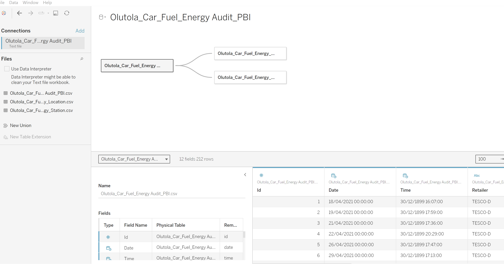
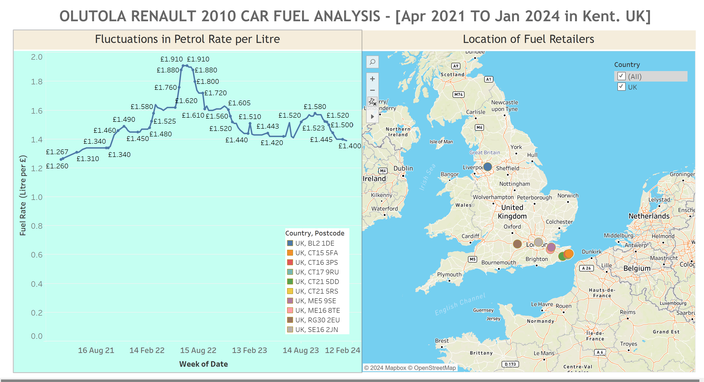
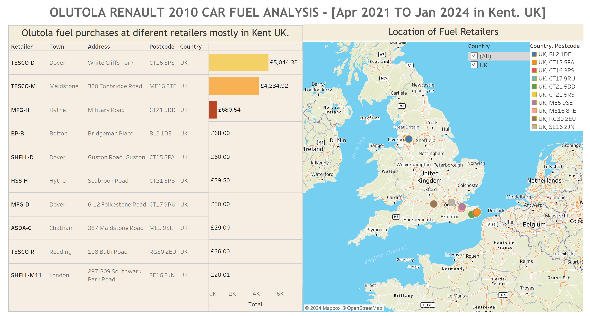

# Car-Energy-Tableau

## Introduction
Before I enter Data Analysis profession, I like data collections as a scientist and an engineer. I love keeping records of events.
One of the events I appreciate is keeping records of my purchases, basically for budgeting and tracking my expenses. One purchases I consistently kept me receipts is my 2010 Renault Scenic car fuel consumptions for three years. Now that I am a Data Analyst, I become hungry for data and I pulled out all my receipts for analysis.

## Data Entry
The first task was to enter the over 200 receipts into an excel spreadsheet with all relevant details on each receipt, like the date, time, retailers name, location, volume of petrol, rate of purchase and other information.

## Data Transformation and Modelling

With relevant information on spreadsheet, I transformed the data from 14 columns and over 200 rows into three significant Tables, mainly consumption, location and retailers with their primary and foreign keys. These Tables were entered into the Data Sources of Tableau.

## Visualisations
Two visualisations were generated:

### Petrol Rate

This visualisation shows the fluctuation of petrol rates from April 2021 to January 2024 mainly in Kent Country where purchases were made. These rates were not the same for different parts of the UK, with some even higher than that in Kent.
The rate was low at 125.9 pence (£1.26), in April 2021 when the recording started, as the nation was coming out of the COVID-19 pandemic lockdown and rose above 170 pence (£1.70) to the highest at 190.9 pence (£1.91) and back 170 pence (£1.70) between June and September 2022 as the Russian-Ukraine war became very hot.
Again, there was another rise from 140 pence to a height of 158 pence between July and October 2023 within which Israel-Hamas crisis began.

### Retailers & Purchases

This shows various place Olutola was purchasing his fuel.
It can be seen that most purchases were done at TESCO-D, which reflected the Supermarket Olutola used regularly because of his dwelling, followed by TESCO-M where Olutola worked.

## Conclusion
As stated earlier, the purpose of keeping fuel receipt is for expenses and budgeting.
However, this project is work in progress because there are many more that can be achieved in form of predictive, prescriptive, and cognitive analysis on this single project.

#### Tableau link
You can interact with the report .[here](https://public.tableau.com/app/profile/olutola.fakehinde/viz/OlutolaCarEnergyAnalysis_06022024/Dashboard1?publish=yes)

